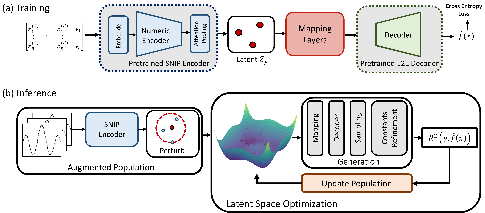

# Deep Symbolic Regression with Multimodal Pretraining & Latent Space Optimization

Official Implementation of **Using SNIP for Symbolic Regression** in the paper [SNIP: Bridging Mathematical Symbolic and Numeric Realms with Unified Pre-training](https://arxiv.org/abs/2310.02227). 


## Overview
**SNIP** stands for **Symbolic-Numeric Integrated Pretraining**, referring to the multi-modal transformer model pretrained betwen symbolic equation of math functions and their numeric data obervations. Here, we show the benefits of SNIP representations for the complex task of Symbolic Regression, a numeric-to-symbolic generation task of uncovering symbolic math equations from data observations.

There are two main steps to using SNIP for Symbolic Regression:
- **Training:** Train an Expression Generation Decoder to the SNIP Numeric Encoder.
- **Inference:** Look for better equations by exploring SNIP's latent space.


<p align="center">
 
 <br>
<b>Using SNIP Numeric Encoder for Symbolic Regression. (a) For training, we add a decoder module to generate expressions to the SNIP numeric encoder; (b) For inference, we optimize decoded expressions in SNIP's latent space.</b>
</p>


## Installation
Follow the installation steps from the SNIP repository **[Multimodal-Math-Pretraining](https://github.com/deep-symbolic-mathematics/Multimodal-Symbolic-Regression)**. To install, use:
```
conda env create -f environment.yml
```
Note: Requires `python>3.7`.


## Training
To train your model for Symbolic Regression using the SNIP Numeric Encoder, follow these steps:

Download the required model weights:
* **SNIP Weights:** Get them from [here](https://drive.usercontent.google.com/download?id=1Q3g6rzqkguHt0krolOKGh4OA5f3JwZLe&export=download&authuser=0&confirm=t&uuid=8de0d6d8-00b5-4820-9ca4-1132d655f02f&at=APZUnTU8MZN1sqlewgAWqVSS00O1:1704728992176)
* **E2E Weights:** Available [here](https://dl.fbaipublicfiles.com/symbolicregression/model1.pt)

Place both in the `weights/` directory of the project. Then, run the following command to start training.
```
python train.py --reload_model_snipenc ./weights/snip-10dmax.pth \
                --reload_model_e2edec ./weights/e2e.pth \
                --freeze_encoder True \
                --batch_size 128 \
                --dump_path ./dump \
                --max_input_dimension 10 \
                --n_steps_per_epoch 1000 \
                --max_epoch 100000 \
                --exp_name snipe2e \
                --exp_id run-test \
                --lr 4e-5 \
                --latent_dim 512 \
                --save_periodic 10
```
This command includes various parameters to customize your training, like batch size, learning rate, and maximum epochs. If you want to freeze the SNIP encoder during training, use `--freeze_encoder True`. For a deeper understanding of how training is set up, including how the model selects specific modules from the weights, take a look at the `train.py` file.


## Encoder-Decoder Model
Download the Encoder-Decoder Symbolic Regression model weights **[here](https://drive.google.com/drive/folders/1eUGm3l7bFpwV10sx7Y-_u-OoyHF5ZAOa?usp=sharing)**. Save it in `weights/snip-e2e-sr.pth`. To use this model, simply activate the `--reload_model` parameter with the model path.


## SR Benchmark Datasets
* **Feynman** equations are [here](https://space.mit.edu/home/tegmark/aifeynman.html)
* **PMLB** datasets are also [here](https://github.com/EpistasisLab/pmlb/tree/master/datasets). Data points of PMLB datasets are used in the [SRBench (A Living Benchmark for Symbolic Regression)](https://github.com/cavalab/srbench), containing three data groups: **Feynman**, **Strogatz**, and **Black-box**.
      
Extract the datasets to this directory, Feynman datasets should be in `datasets/feynman/`, and PMLB datasets should be in `datasets/pmlb/`. 


## Latent Space Optimization
As SNIP representations have strong pretrained information about potential mutual symbolic-numeric similarities, Latent Space Optimization (LSO) significantly boosts the quality of decoded equations. To run LSO for your problem, check `run_lso.sh` file. 

Example of LSO run with default optimizer: 
```
python LSO_eval.py --reload_model ./weights/snip-e2e-sr.pth \
                    --eval_lso_on_pmlb True \
                    --pmlb_data_type strogatz \
                    --target_noise 0.0 \
                    --max_input_points 200 \
                    --lso_optimizer gwo \
                    --lso_pop_size 50 \
                    --lso_max_iteration 80 \
                    --lso_stop_r2 0.99 \
                    --beam_size 2
```

Here, LSO is performed on the representations of the pretrained model `./weights/snip-e2e-sr.pth`. To test LSO on other data groups, you can simply change `--pmlb_data_type` parameter to `feynman` or `blackbox`. LSO algorithm is designed with the [GWO](https://www.sciencedirect.com/science/article/abs/pii/S0965997813001853) optimizer by default. However, if you're interested, you can also try other gradient-free optimizers from the **[nevergrad](https://github.com/facebookresearch/nevergrad)** library by just changing the `--lso_optimizer` parameter. 


## Citation
If you find the paper or the repo helpful, please cite it with
<pre>
@article{meidani2023snip,
  title={SNIP: Bridging Mathematical Symbolic and Numeric Realms with Unified Pre-training},
  author={Meidani, Kazem and Shojaee, Parshin and Reddy, Chandan K and Farimani, Amir Barati},
  journal={arXiv preprint arXiv:2310.02227},
  year={2023}
}
</pre>


## License 
This repository is licensed under MIT licence.

## Contact Us
For any questions or issues, you are welcome to open an issue in this repo, or contact us at mmeidani@andrew.cmu.edu, and parshinshojaee@vt.edu.